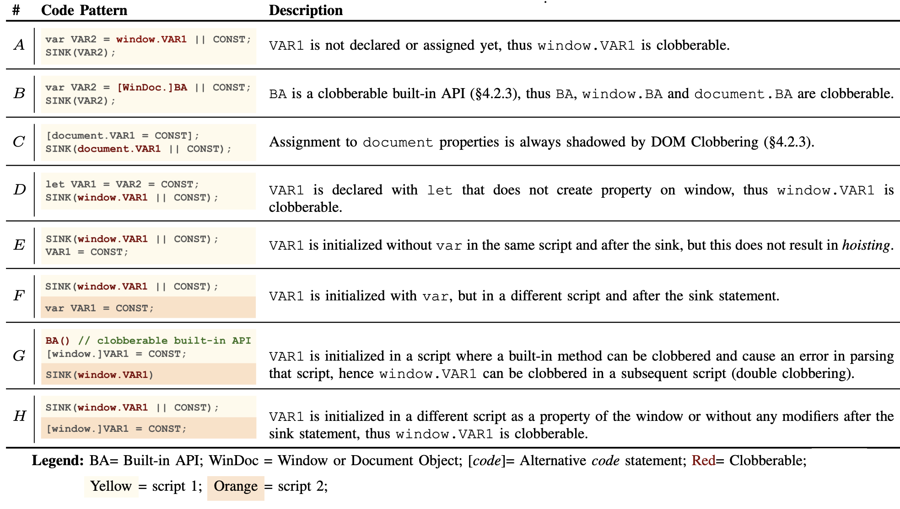



# DOM Clobbering Wiki

Stable
{: .label .label-green }

## DOM Clobbering Code Patterns

Common DOM Clobbering vulnerable code patterns are listed below. 

  

The most common mistakes are patterns A and E, in which the developer references an undefined variable through the `Window`object, and then use the result in a sensitive instruction, whereas the least common, but also more complex mistakes are patterns F, G and H where the vulnerability originates due to the position of the instructions that span across two different script tags. 

Other common mistakes are patterns B and C, where developers treat custom and native document and window properties as trusted values that can be safely used in sensitive operations. The rest of this section presents secure coding patterns that can prevent DOM Clobbering.

## Secure Patterns & Guidelines

This section presented a list of recommendations, best practices and secure coding patterns that can resolve [DOM Clobbering code patterns](#dom-clobbering-code-patterns), and will be incrementally updated. 

### Explicit Variable Declarations

As shown in the above table, a key element enabling DOM Clobbering is use of the `||` operator to rely on specific defaults when the primary, intended variable or property is undefined. As an alternative solution, developers can initialize those variables with the default value when they are undefined using `var` declarations, which prevents named properties to overshadow them according to the [named property visibility algorithm](https://webidl.spec.whatwg.org/#legacy-platform-object-abstract-ops). This solution could patch the patterns A, D, E, F, and H. When the value needs to be used in multiple scripts, as in patterns F and H, the declaration should be in the same (or a previous) script, but not in subsequent ones.

### Strict Type Checking

Another common mistake enabling DOM Clobbering is treating DOM properties, like `document` and `window` properties as safe, trusted values (e.g., patterns B, C, and G). Instead, developers should extend the trust boundary to these properties, verifying their type before using them in security-sensitive instructions, e.g., by leveraging the `instanceof` and `typeof` operators.

### Do Not Use Document for Global Variables

Properties of `document` can always be overwritten by DOM Clobbering, even immediately after they are assigned a value, as in pattern C. Accordingly, developers should refrain from using `document` as a mean to store and retrieve global values. Instead, they can declare variables with `const` or `var` in the global context, or use the [globalThis](https://developer.mozilla.org/en-US/docs/Web/JavaScript/Reference/Global_Objects/globalThis) object. 

### Namespace Isolation

While robust sanitizers may remove [named properties](https://webidl.spec.whatwg.org/#dfn-support-named-properties), an alternative solution is to separate the namespace of variables defined by JavaScript code and named properties in user-generated markups. For example, the markdown to HTML converter of source code version control applications often prefix `id` and `name` attribute values of user-generated markup with a specific string. Motivated by this solution, one can monitor runtime changes in the DOM tree via the [MutationObserver API](https://developer.mozilla.org/en-US/docs/Web/API/MutationObserver), and prefix named properties of all dynamically inserted markups before adding them to the tree, which patches all aforementioned vulnerable patterns.

